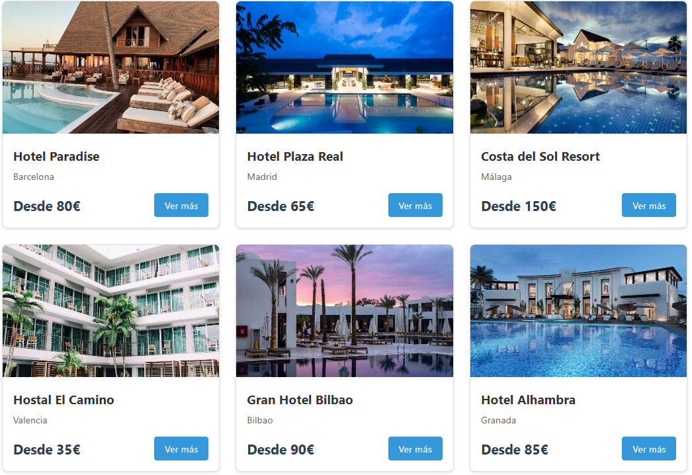

# Hotel Finder - Documentación del Proyecto

**Alumno:** David Garcia Sesma  
**Asignatura:** Diseño de Interfaces - 2º DAM  
**Curso:** 2025-2026

---

## 1. Información del Proyecto

### Nombre de la aplicación
Hotel Finder

### Propósito
Aplicación web para búsqueda y consulta de hoteles con sistema de filtros dinámicos.

### Funcionalidades principales
- Búsqueda de hoteles por nombre o ciudad
- Filtrado por rango de precio, desayuno incluido y aceptación de mascotas
- Ordenación por precio (ascendente/descendente)
- Visualización de detalles completos de cada hotel
- Listado de habitaciones disponibles con sus características

---

## 2. Tecnologías Utilizadas

- **Frontend:** React 18 con React Router
- **API:** JSON Server (mock API local)
- **Control de versiones:** Git + GitHub con metodología Gitflow
- **Estilos:** CSS inline (styles objects)

---

## 3. Estructura de Componentes

### Componentes de Layout
- `Header`: Cabecera con navegación
- `Footer`: Pie de página

### Componentes Comunes (Reutilizables)
- `Tarjeta`: Componente genérico para mostrar hoteles y habitaciones
- `Loading`: Indicador de carga
- `ErrorMessage`: Mensajes de error

### Componentes Específicos
- `PanelFiltros`: Panel lateral con todos los controles de filtrado
- `ListaHoteles`: Página principal con grid de hoteles
- `DetalleHotel`: Página de detalle con información completa

### Servicios
- `hotelService`: Servicio para consumir la API REST

---

## 4. Aplicación de Leyes de Gestalt

### Ley 1: PROXIMIDAD

**Definición:**
Los elementos que están cerca unos de otros se perciben como un grupo relacionado.

**Aplicación en el proyecto:**
En las tarjetas de hoteles, he agrupado la información relacionada mediante espaciado:
- La imagen del hotel está pegada al contenedor de la tarjeta
- El título, ciudad y precio están agrupados con poco espacio entre ellos
- Las tarjetas están separadas entre sí con un gap de 2rem

**Justificación:**
Esto permite que el usuario identifique rápidamente qué información pertenece a cada hotel sin confundir datos de diferentes tarjetas. La proximidad visual refuerza la agrupación lógica de la información.

**Captura:**

---

### Ley 2: SIMILITUD

**Definición:**
Los elementos que comparten características visuales (forma, color, tamaño) se perciben como relacionados o del mismo tipo.

**Aplicación en el proyecto:**
Todas las tarjetas de hoteles mantienen:
- El mismo formato visual (borde redondeado, sombra sutil)
- La misma estructura (imagen arriba, información abajo)
- El mismo estilo de tipografía y colores
- Las mismas proporciones y tamaño

**Justificación:**
Esta consistencia visual ayuda al usuario a entender que todos los elementos son del mismo tipo (hoteles disponibles). Si una tarjeta tuviera un estilo diferente, el usuario podría pensar que representa algo distinto (como un anuncio o una categoría especial).

**Captura:**

---

## 5. Decisiones de Diseño

### API Mock vs API Real
Decidí crear una API mock con JSON Server para tener control total sobre los datos y poder implementar todas las funcionalidades sin limitaciones de APIs externas gratuitas.

### Componente Tarjeta Reutilizable
Diseñé un componente genérico que sirve tanto para hoteles como para habitaciones, recibiendo diferentes props según el contexto. Esto reduce duplicación de código y facilita el mantenimiento.

### Filtros Dinámicos
Implementé todos los filtros con onChange para proporcionar feedback inmediato sin necesidad de botones de "Buscar", mejorando la experiencia de usuario.

---

## 6. Endpoints de la API

1. `GET /hotels` - Obtiene lista completa de hoteles
2. `GET /hotels/:id` - Obtiene detalle de un hotel específico
3. Filtrado realizado en el cliente mediante JavaScript

---

## 7. Repositorio Git

**URL:** https://github.com/davidgarcia11/hotel-finder-DI

**Metodología:** Gitflow con ramas feature/* mergeadas a develop